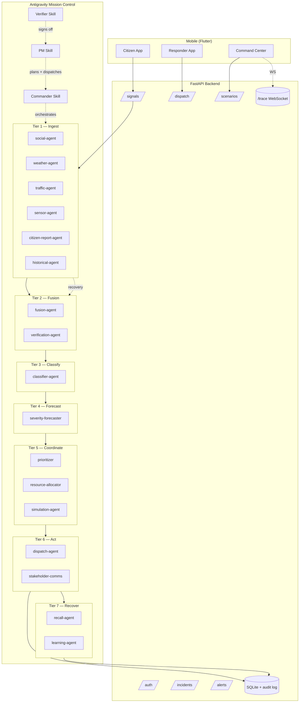

# Architecture

## High-level



## Data flow per round

1. **Tier 1** — six ingest agents run in parallel. Each emits a structured envelope (agent, tier, decision, confidence, evidence).
2. **Tier 2** — FusionAgent clusters by zone + geo proximity; VerificationAgent ranks hypotheses.
3. **Tier 3** — ClassifierAgent runs a 5-vote ensemble (Gemini Flash with seed jitter), returns type + severity + confidence.
4. **Tier 4** — SeverityForecaster runs 200-sample Monte Carlo on radius × duration × population, returns p10/p50/p90 bands.
5. **Tier 5** — Prioritizer ranks all live incidents; Allocator solves a Hungarian bipartite match; Simulator estimates before/after state with side effects.
6. **Tier 6** — Dispatch emits asset tickets; StakeholderComms emits 6 channel-tailored messages (public bilingual, hospital, utility, traffic-police, media, command).
7. **Tier 7** — RecallAgent handles flips; LearningAgent updates source trust scores.

## PM / Verifier loop

Every sprint follows this lifecycle:
```
PM reads sprints/sprint-N.md
    -> dispatches tasks (parallel where safe)
    -> tracks follow-ups in sprints/progress.md
    -> invokes Verifier
    -> Verifier walks acceptance criteria (file/schema/test/manual)
    -> verdict: pass | partial | fail
    -> if pass: PM writes sprints/completed/sprint-N.json + unblocks N+1
    -> if not: PM creates remediation tasks and re-runs
```

## Storage

- **SQLite** for incidents, dispatches, alerts, signals, audit_log (append-only).
- **Filesystem** for artifacts under `artifacts/<run-id>/<tier>/` so traces are inspectable without a tool.
- **In-memory pub/sub** (TraceBus) for the `/trace` WebSocket.

## LLM strategy

- All agents are deterministic by default; LLM (Gemini Flash) adds rationale prose, Urdu translation, and ensemble jitter.
- Without `GEMINI_API_KEY` the system uses an offline mock that emits fixed-jitter rationales — every test run is reproducible.
- With the env var set, the same call sites hit Gemini 3 Flash. Switching is one boolean.
